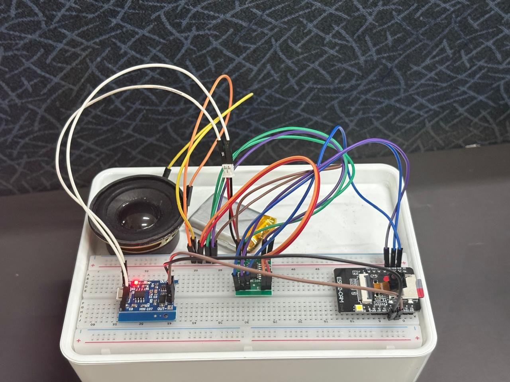
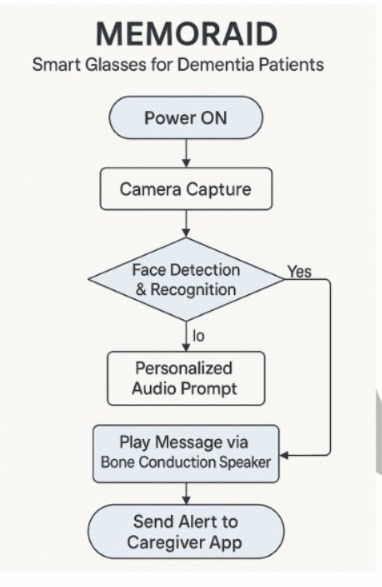
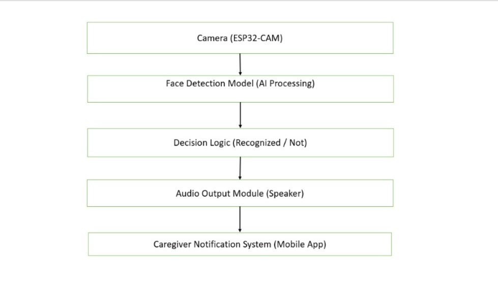
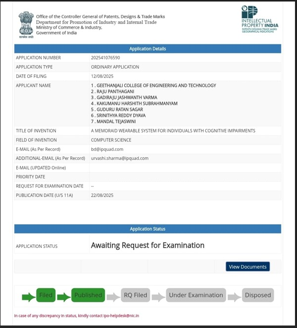

# MEMORAID: AI Smart Glasses for Dementia Assistance

-brightgreen)

---

## Project Summary

MEMORAID is a patent-published intelligent wearable system designed to assist individuals with dementia and cognitive impairments. The system integrates artificial intelligence, embedded systems, and human-centered design into a compact smart spectacle platform.

It provides real-time contextual assistance through face recognition, personalized audio prompts, and caregiver connectivity, enabling improved independence and safety.

---

## Overview

Dementia affects millions of individuals worldwide, causing memory loss, confusion, and increasing dependence on caregivers. Patients often struggle to recognize familiar faces and recall important daily interactions.

MEMORAID addresses this problem by embedding an AI-powered assistive system directly into wearable smart glasses, enabling real-time interaction with the user’s environment.

---

## Key Features

• Real-time face detection and recognition  
• Personalized audio prompts via bone conduction speaker  
• Caregiver notification system  
• Lightweight ESP32-CAM based embedded system  
• Wearable, discreet smart glasses design  
• Patent-published innovation  

---

## System Workflow

The system follows a sequential pipeline:

1. Device is powered on  
2. Camera captures real-time visual input  
3. Face detection and recognition algorithm processes the image  
4. If a match is found, a personalized audio prompt is generated  
5. Audio is delivered through the speaker system  
6. Caregiver is notified when required  

---

## System Architecture

The architecture includes:

• Camera Module (ESP32-CAM) – captures real-time images  
• AI Processing Unit – performs face detection and recognition  
• Decision Logic Engine – determines recognition outcome  
• Audio Output System – delivers prompts to the user  
• Caregiver Interface – sends alerts and updates  

---

## Hardware Setup

The hardware system consists of:

• ESP32-CAM module  
• OV2640 camera sensor  
• Bone conduction speaker  
• Audio amplifier module  
• Breadboard and jumper wires  
• Power supply system  

Detailed hardware information is available in the `hardware/` directory.

---

## Software Overview

The system integrates:

• Computer vision for face recognition  
• Embedded firmware for ESP32  
• Image processing using OpenCV  
• Future mobile application for caregiver interaction  

Detailed implementation will be available in the `software/` directory.

---

## Patent Information

Patent Title:  
Smart Wearable for Memory Support in Dementia Patients  

Application Number:  
202541076593  

Publication Date:  
22 August 2025  

Jurisdiction:  
Indian Patent Office  

Status:  
Patent Published – Awaiting Examination  

[View Full Patent Document](patent/memoraid_patentpdf.pdf)

---

## Repository Structure

design/ → Product design and future 3D models  
docs/ → Technical documentation  
hardware/ → Hardware setup and components  
images/ → Diagrams and visual assets  
patent/ → Patent documents and proof  
research/ → Invention disclosure materials  
software/ → AI and embedded system code  

---

## Future Work

• Advanced AI models for improved recognition accuracy  
• Mobile application for caregiver interaction  
• Miniaturization into wearable smart glasses  
• Real-world usability testing  
• Cloud-based data integration  

---

## Contributors

Geethanjali College of Engineering and Technology

Mandal Tejaswini  
Gadiraju Jashwanth Varma  
Kakumanu Harshith Subrahmanyam  
Srinithya Reddy Dyava  

---

## License

This project is released under the Apache 2.0 License.
