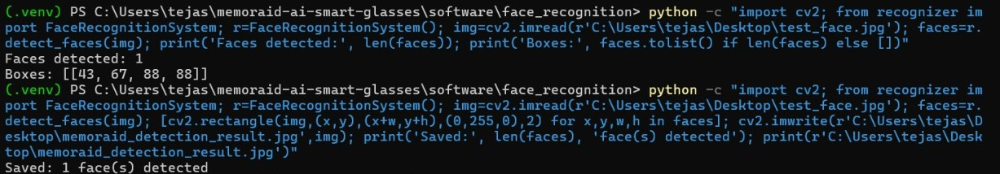
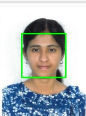
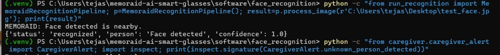

# MEMORAID Software

This directory contains the software reference implementation for the MEMORAID smart-glasses system.

The software demonstrates the pipeline from image acquisition and face detection to audio feedback and caregiver alert generation.

> **Note:** The current implementation is a reconstructed/reference implementation for demonstrating the MEMORAID software pipeline. The OpenCV module currently performs face detection; a dedicated recognition model can be integrated later.

---

## Software Pipeline

```text
ESP32-CAM
    |
    v
Image Acquisition
    |
    v
Face Detection
(OpenCV)
    |
    +------------------+
    |                  |
    v                  v
Audio Feedback     Caregiver Alert
   pyttsx3            Interface
    |                  |
    v                  v
Audio Output       Notification
```

---

## Face Detection

The `face_recognition/` module uses OpenCV for local face-detection testing.

### Features

- Load an input image
- Detect faces
- Generate face bounding boxes
- Produce a visual detection result

### Detection Result





---

## Audio Feedback

The `audio/` module provides the software interface for spoken feedback using `pyttsx3`.

In the physical prototype, the audio output is intended to connect to the audio amplifier and bone-conduction speaker.

### Audio Test



---

## Caregiver Alert

The `caregiver/` module provides a structured interface for generating caregiver alerts.

The current implementation demonstrates alert creation and local logging. A production messaging service can be integrated later.

### Caregiver Alert Test


---

## ESP32-CAM

The `esp32_cam/` module contains reference firmware for the ESP32-CAM.

### Features

- OV2640 camera initialization
- Image capture
- Wi-Fi connectivity
- HTTP image capture endpoint
- Device status endpoint

---

## Test Image

A sample image used for local face-detection testing is included in the repository.


---

## Directory Structure

```text
software/
├── audio/
│   └── audio_feedback.py
├── caregiver/
│   └── caregiver_alert.py
├── esp32_cam/
│   └── memoraid_camera.ino
├── face_recognition/
│   ├── recognizer.py
│   ├── run_recognition.py
│   └── test_face.jpg
├── app.py
├── requirements.txt
└── README.md
```

---

## Technologies

- Python
- OpenCV
- NumPy
- pyttsx3
- Flask
- Arduino / ESP32
- ESP32-CAM
- OV2640 Camera

---

## Current Implementation

| Component | Status |
|---|---|
| ESP32-CAM reference firmware | Implemented |
| Image acquisition interface | Implemented |
| OpenCV face detection | Implemented |
| Detection visualization | Implemented |
| Audio feedback interface | Implemented |
| Caregiver alert interface | Implemented |
| Physical prototype | Available |
| Dedicated identity-recognition model | Future integration |
| Production caregiver notification service | Future integration |

---

## Running the Reference Implementation

Install the required Python packages:

```bash
pip install -r requirements.txt
```

Run the face-detection module:

```bash
python face_recognition/recognizer.py
```

Run the recognition pipeline:

```bash
python face_recognition/run_recognition.py
```

---

## Important Note

The current OpenCV implementation demonstrates **face detection**, not verified identity recognition.

The software architecture is structured so that a dedicated face-recognition model can be integrated into the pipeline in future development.

---

## Future Development

- Integrate a dedicated face-recognition model
- Connect ESP32-CAM image capture directly to the software pipeline
- Improve detection and recognition under different lighting conditions
- Integrate physical audio hardware
- Implement real caregiver notification services
- Optimize the pipeline for embedded deployment
- Evaluate the system using a larger representative dataset
